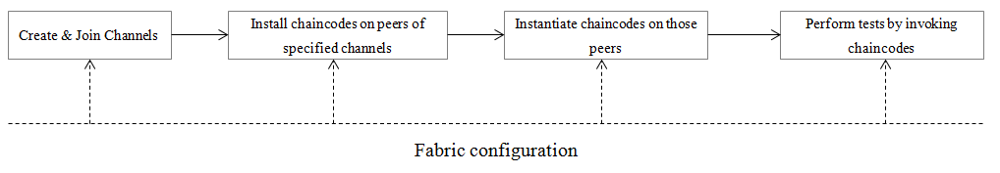

## Fabric Configuration
The fabric configuration is a json file which defines a fabric object with six main properties:

* **cryptodir**: Optionally defines a relative path of the crypto directory which contains all cryptographic materials, all paths defined in the configuration are relative paths to the fabric root directory. The crypto directory structure must be identical with the output of fabric's cryptogen tool. The sub-directories names must match organizations' names defined in *network* element. The certificates and private keys in this directory are used by Caliper to act as the administrator or the member of corresponding organization to interact with fabric network, e.g to create channel, join channel, install chaincode, invoke chaincode, etc. If not present, each organization's cryptographic materials must be defined directly in network property.        
 
```json
{"cryptodir": "network/fabric/simplenetwork/crypto-config"}
```

* **network**: defines the information of orderers and peers of the SUT. For simplicity's sake, only one orderer can be defined now, that causes all proposals being sent to the same orderer, which may hurt ordering performance. That should be fixed in future. The attribute name of organizations and peers must start with 'org' and 'peer'.

  Optionally an `user` attribute can be set with an organization to specify the key and certification that can be used by Caliper to interact with the SUT as a member of corresponding organization. If not present, Caliper will try to find them in `cryptodir`.

```json
{
  "network": {
    "orderer": {
      "url": "grpcs://localhost:7050",
      "mspid": "OrdererMSP",
      "user": {
        "key": "network/fabric/simplenetwork/crypto-config/ordererOrganizations/example.com/users/Admin@example.com/msp/keystore/be595291403ff68280a724d7e868521815ad9e2fc8c5486f6d7ce6b62d6357cd_sk",
        "cert": "network/fabric/simplenetwork/crypto-config/ordererOrganizations/example.com/users/Admin@example.com/msp/signcerts/Admin@example.com-cert.pem"
      },
      "server-hostname": "orderer.example.com",
      "tls_cacerts": "network/fabric/simplenetwork/crypto-config/ordererOrganizations/example.com/orderers/orderer.example.com/tls/ca.crt"
    },
    "org1": {
      "name": "peerOrg1",
      "mspid": "Org1MSP",
      "ca": {
        "url": "https://localhost:7054",
        "name": "ca-org1"
      },
      "peer1": {
        "requests": "grpcs://localhost:7051",
        "events": "grpcs://localhost:7053",
        "server-hostname": "peer0.org1.example.com",
        "tls_cacerts": "network/fabric/simplenetwork/crypto-config/peerOrganizations/org1.example.com/peers/peer0.org1.example.com/tls/ca.crt"
      },
      "peer2": {
        "requests": "grpcs://localhost:7057",
        "events": "grpcs://localhost:7059",
        "server-hostname": "peer1.org1.example.com",
        "tls_cacerts": "network/fabric/simplenetwork/crypto-config/peerOrganizations/org1.example.com/peers/peer1.org1.example.com/tls/ca.crt"
      }
    }
  }    
}
```    

* **channel**: defines one or more channels used for the test. The 'deployed' property is used to define whether the channel has already been deployed (false as default when the property is missing). If the value is false, the defined channels can be created automatically by calling *Blockchain.init()* function. The binary tx file created by fabric configtxgen tool is used to provide details of the channel. 
```json
{
  "channel": [
    {
      "name": "mychannel",
      "deployed": false,
      "config": "network/fabric/simplenetwork/mychannel.tx",
      "organizations": ["org1", "org2"]
    }
  ]
}
```

* **chaincodes**: defines one or more chaincodes, those chaincodes can be installed and instantiated on all peers of the specific channel by calling *Blockchain.installSmartContract()* function.  
  
  Optionally an `init` attribute can also be set to an array of *string* values. This array will be passed as the argument to the chaincode's *Init* method. The `init` attribute defaults to an empty array.
  
  The *path* attribute is relative to the *caliper/src* folder, since *$GOPATH* is temporarily set to the caliper root folder during benchmark execution. If you would like to install a Golang chaincode from a previously set *$GOPATH*, then set the *OVERWRITE_GOPATH* environment variable to *FALSE* before running the benchmark:  
  ```GOPATH=~/mygopath OVERWRITE_GOPATH=FALSE node main.js```
```json
{
  "chaincodes": [
    {
      "id": "drm", 
      "path": "contract/fabric/drm", 
      "version": "v0", 
      "channel": "mychannel",
      "init": ["init_arg1", "init_arg2"]
    }
  ]
}
```
* **endorsement-policy**: defines the endorsement policy for all the chaincodes. Currently, only one policy can be defined and the policy is applied to all chaincodes.    
```json
{
  "endorsement-policy": {
    "identities": [
      {
        "role": {
          "name": "member",
          "mspId": "Org1MSP"
        }
      },
      {
        "role": {
          "name": "member",
          "mspId": "Org2MSP"
        }
      }
    ],
    "policy": { "2-of": [{"signed-by": 0}, {"signed-by": 1}]}
  }
}
```

* **context**:defines a set of context to tell Caliper which fabric channle will be interacted with later. The context name(key) is the name of the test round defined by *test.rounds[x].label* in the test configuration file if the default [test framework](./Architecture.md#test-framework) is used. In this way, developers could use different fabric environment for different test rounds. The information is used by getContext() function to properly create a fabric client for later use, and register block events with appropriate peers.
```json
{
  "context": {
    "publish": "mychannel",
    "query": "mychannel"
  }
}
```

The diagram below shows the typical fabric test flow.


###Info Property
The configuration file may contain an 'info' property which is a common property for all blockchain configuration files. Users can use this property to disclose any information about the system under test (SUT). Caliper's report generator will read this property and add the information into the generated testing report. This property may contain any user defined key/value pairs. A special key named 'details', is reserved particularly to contain detailed information about the SUT.
```json
{
  "info": {
    "Version": "1.0.0",
    "Size": "4 Peers",
    "Orderer": "Solo",
    "Distribution": "Single Host",
    "details": "not provided"
  }
}
```


## TODO List
* network: allow to define mulitple orderers and implement load balancing for ordering proposals.
* channel: allow to define row information of the channel directly as alternative option, instead of the tx file.  
* endorsement-policy: allow to define multiple policies and relation between policy and chaincode.
